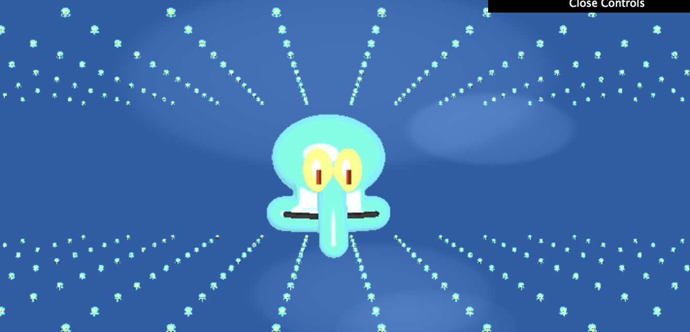

# CIS 566 Project 2

Name: Chloe Snyder
Pennkey: csny

github.io demo: https://chloesnyder.github.io/homework-2-implicit-surfaces-chloesnyder/

## External Resources
Exact usages are cited in code comments.
- [Jamie Wong Ray Marching](http://jamie-wong.com/2016/07/15/ray-marching-signed-distance-functions/)
- [ToonShader](http://prideout.net/blog/?tag=toon-shader)
- [More ToonShader](https://en.wikibooks.org/wiki/GLSL_Programming/Unity/Toon_Shading)
- [Bubble backgroun](https://www.shadertoy.com/view/4slGDr)
- [Iq's sdf functions](http://iquilezles.org/www/articles/distfunctions/distfunctions.htm)
- [Iq's smin function](http://iquilezles.org/www/articles/smin/smin.htm)

## Explanation of controls
- No controls

## Explanation of Techniques

- Created the squidward head like a scenegraph.
- SceneSDF(vec3 p) = calls squidward function, and domain repetition on squidward, returns union to get both a big central squidward and repeated domain
- Squidward function makes 1 squidward and returns the union of head and nose.
- nose is created from a capsule SDF that is bent slightly, rotated and translated and scaled as appropriate
- head is created from the union of skull, eyes, and mouth.
- skull  is a union of a cube and a circle with a smooth minimum function
- eyes are a difference SDF of a union of 2 sphere sdfs, scalled to be ellipsoids,  and unionr of 2 pupils (cubeSDFs)
- Mouth is another capsule SDF that is bent and animated with time to frown and smile. A line is inserted by taking the difference
- Specific features are colored within their "body" function. Global values for ambient, diffuse and specular colors are set in the body function. If they're not set here, then the toon shader colors it accordingly.
- Background created by drawing circles at random seeds and accumulating colors on each new bubble
- Sphere marching sdf function (jamie wong)

